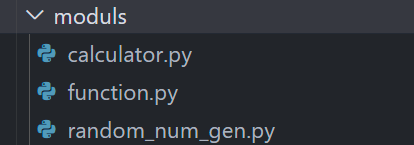
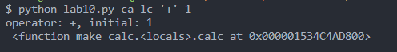
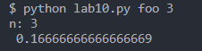
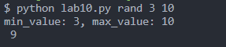

### Прог. Лабораторная работа №10

Задания для самостоятельного выполнения

Сложность:
Rare
1.Создайте пакет, содержащий 3 модуля на основе лабораторных работ №№ 7-9

2.Напишите запускающий модуль на основе Typer, который позволит выбирать и настраивать параметры запуска логики из пакета.

Оформите отчёт в README.md. Отчёт должен содержать:

Условия задач

Описание проделанной работы

Скриншоты результатов

Ссылки на используемые материалы

## Решение

#### 1.сперва я создал пакет, содержащий 3 модуля на основе лабораторных работ №7-9




##### Лабораторная работа №7 function

```python
 def calculate_xi(n):
    if n == 1:
        return 1
    if n == 2:
        return -1 / 8
    return ((n - 1) * calculate_xi(n - 1)) / 3 + ((n - 2) * calculate_xi(n - 2)) / 4
```

##### Лабораторная работа №8 calculator

```python
 def make_calc(operator, initial=0):

    result = initial


    def calc(num):

        nonlocal result

        if operator == "+":

            result += num

        elif operator == "-":

            result -= num

        elif operator == "*":

            result *= num

        elif operator == "/":

            result /= num

        return result


    return calc
```

##### Лабораторная работа №9 random_num_gen

```python
 import time

def generate_random_number(min_val, max_val):
    # Используем текущее время для генерации случайного числа
    seed = int(time.time() * 1000)
  
    # Вычисляем псевдослучайное число 
    random_num = (seed % (max_val - min_val + 1)) + min_val
  
    return random_num
```

#### 2.Напишите запускающий модуль на основе Typer, который позволит выбирать и настраивать параметры запуска логики из пакета.(Так как Typer не работает с функциями которые принимают списки поэтому эти функции я не добавлял )

```python
import typer

from moduls import calculator, function, random_num_gen

app = typer.Typer()


@app.command()
def ca_lc(operator: str, initial: int):
    print(f'operator: {operator}, initial: {initial}\n', calculator.make_calc(operator, initial))


@app.command()
def foo(n: int):
    print(f'n: {n}\n', function.calculate_xi(n))


@app.command()
def rand(min_val: int, max_val: int):
    print(f'min_value: {min_val}, max_value: {max_val}\n', random_num_gen.generate_random_number(min_val, max_val))


if __name__ == "__main__":
    app()
```

## Терминал







### Список использованных источников

1.https://younglinux.info/oopython/module
